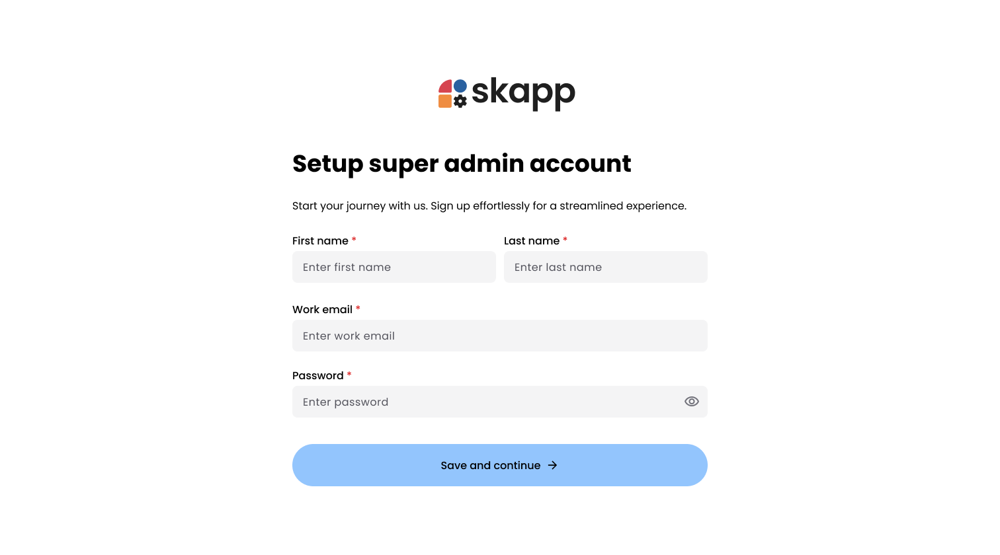
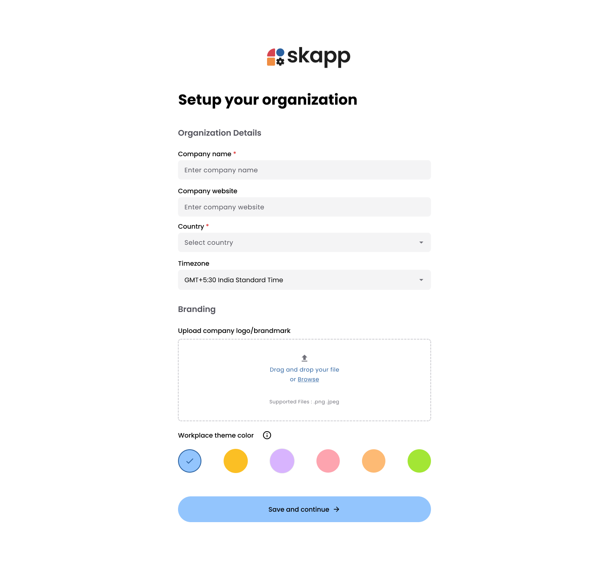

## Introduction

Setting up your organization is the first step in unlocking the full potential of the **Skapp** community version. This process ensures that the system is tailored to your organization's unique needs. The setup is divided into two essential phases:

1. Creating the **Super Admin Account**, which acts as the primary user for managing the system.
2. Configuring **Organization Details**, including foundational settings like the organization name, country, logo, and theme colors.

By completing these steps, you'll establish a secure and personalized environment for your organization, enabling seamless management and functionality.

---

## Super Admin Account Setup

### Step 1: Provide Super Admin Details

The Super Admin must fill out the following information:

#### First Name and Last Name

- Both fields are **mandatory**.

#### Work Email

- Enter a valid email address for the Super Admin.

#### Password

- Set a secure password adhering to the following requirements:
  - At least one **lowercase character**.
  - At least one **uppercase character**.
  - At least one **number**.
  - At least one **special character** (e.g., @, $, %, etc.).
  - Minimum length: 8 characters.
- Use the eye icon to toggle password visibility for verification.

---

:::danger[Important]

- This work email address and password will be used as the username for logging into the system.

:::

### Step 2: Save and Continue

1. After completing all fields, click **Save and Continue**.

- The system will validate the entered details.
- Upon success, you'll proceed to the **Organization Setup** step.

---

## Organization Setup

### Step 1: Enter Organization Information

Provide the necessary details about your organization:

#### Organization Name

- Mandatory field.
- Enter the name of your organization.

#### Company Website

- Optionally, add your organization's website URL for reference.

#### Country

- Select the organization's country from the dropdown menu.
- Mandatory field.

#### Timezone

- Select the timezone for your organization.

:::danger[Important]

- The selected timezone will apply to all employees in the organization and is a **one-time setup**.
  :::

#### Logo

- Optionally, upload a logo for your organization

:::warning[File Requirement]

- Supported formats: jpg, gif, png.
- Maximum file size: 5MB.

:::

#### Theme Color Selection

- Choose a theme color for the platform:
  - You can personalize the appearance by selecting a different color during setup.

---

### Step 2: Save and Continue

1. After entering all details, click **Save and Continue**.
2. The system validates your inputs.
3. Once validated, you will be redirected to the **Dashboard**, marking the completion of the setup.

---
