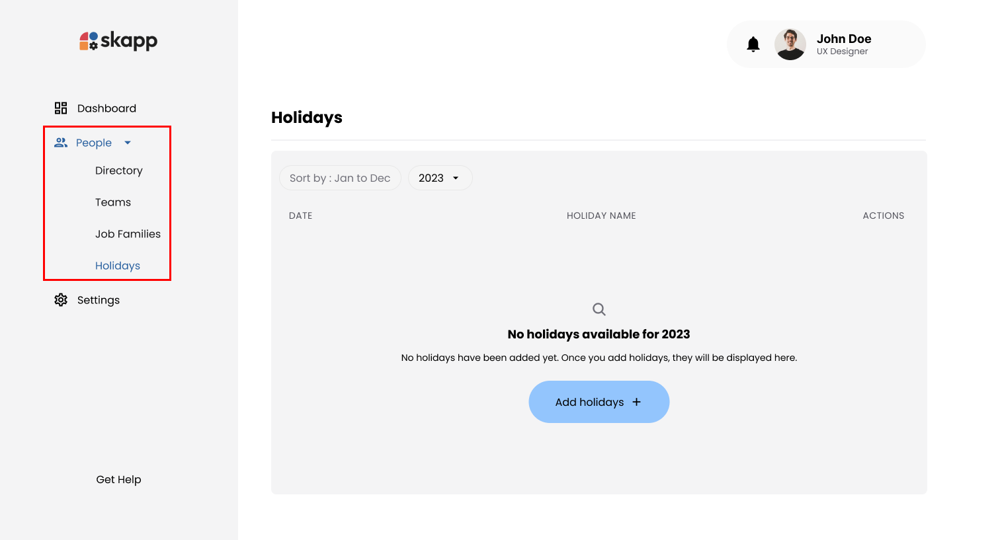
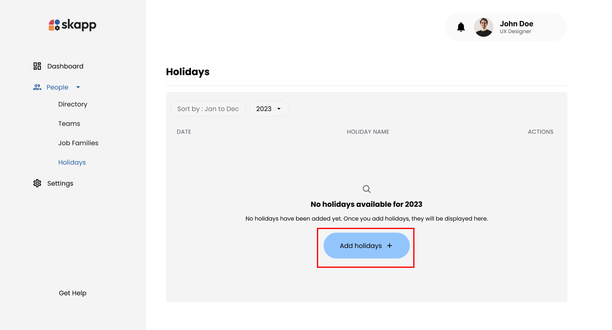
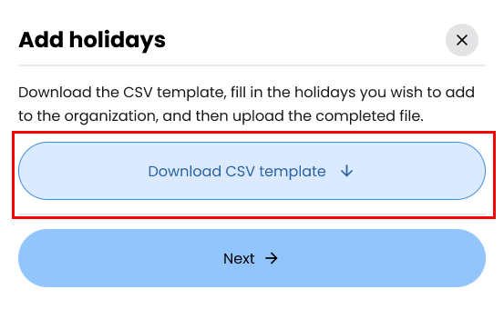
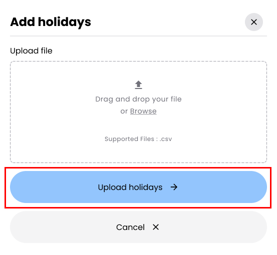
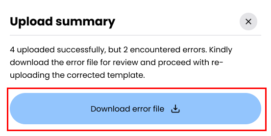
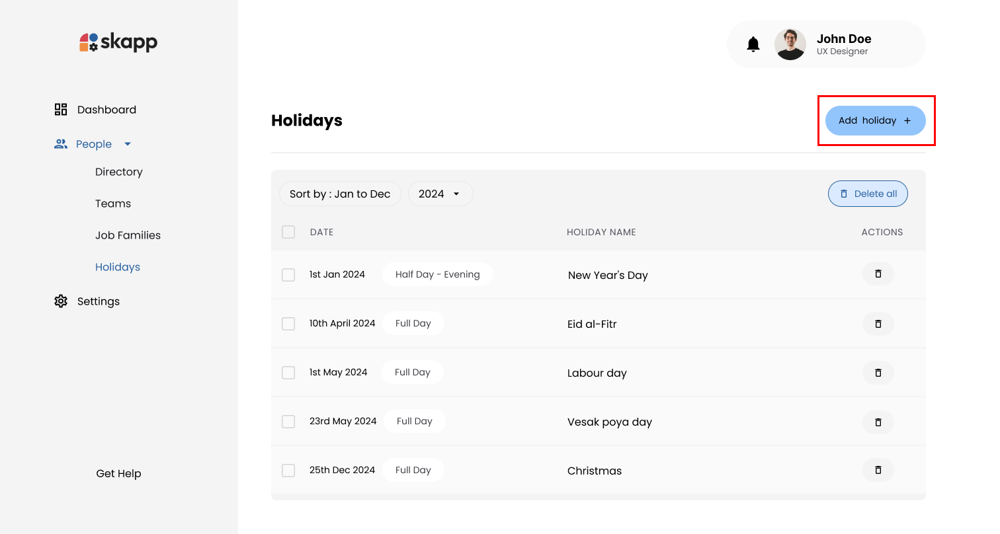
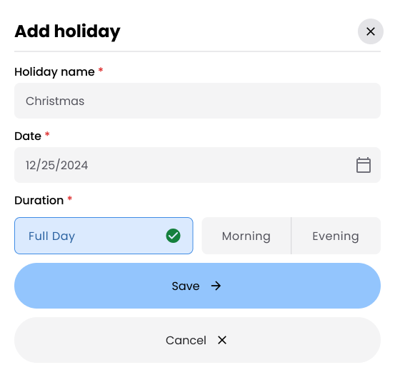
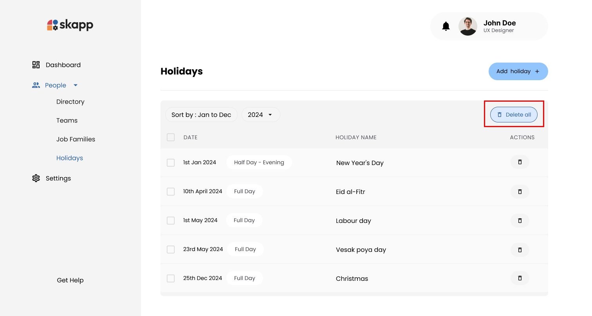
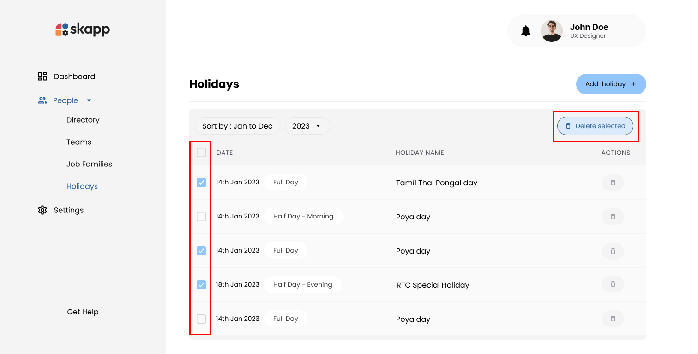
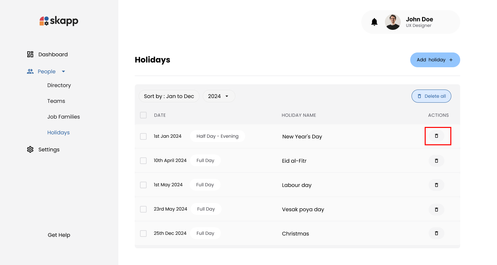

## Introduction

Holidays in **Skapp** are essential for accurate leave management and scheduling. Organization can bulk upload, add, or delete holidays to ensure the system reflects the organization's non-working days. Bulk uploading holidays is recommended as the initial step when no holidays have been added yet for the selected year. Once the bulk upload is complete, individual holidays can be added or modified as needed.

---

## Accessing the Holidays Page

:::info

- Users with the `Super Admin` and `People Admin` roles can manage holidays.
- Users with the `People Manager` role can only view holidays.
  :::

1. Click on the **People** option in the main navigation bar.
2. Select the **Holiday** sub-menu option.

---

## Bulk Uploading Holidays

### Introduction

:::warning[Important]

The **Holiday Bulk Upload** feature is **available exclusively when no holidays have been added for the selected year**.

## :::

### Step 1: Download the CSV Template

1. Click the **Add Holiday** button on the Holidays page to open the **Add Holiday Template Download** modal.

2. Click the **Download Template** button and save the CSV file to your computer.

---

### Step 2: Prepare the CSV File

1. Open the downloaded CSV file in a spreadsheet editor (e.g., Microsoft Excel, Google Sheets).
2. Fill in the required fields for each holiday:
   - **Holiday Name**: Unique name for the holiday (max 50 characters, no numbers or special characters).
   - **Date**: Use the format `YYYY-MM-DD` (e.g., `2024-07-04`). Only future dates within the selected year are allowed.
   - **Duration**: Choose one of the following:
     - `Full Day`
     - `Half Day-Morning`
     - `Half Day-Evening`

3. Ensure no more than **3 holidays** are scheduled on the same day.
4. Save the file in CSV format.

---

### Step 3: Upload the CSV File

1. Return to the **Add Holiday** modal.
2. Click the **Next** button to proceed to the upload step.
3. Drag and drop the CSV file into the upload area or click **Browse** to select the file from your computer.

---

### Step 4: Validate and Confirm Upload

1. Click **Upload Holidays** to process the file.
2. The system validates the file and identifies any errors:
   - If there are issues, download the **Error Log**, fix the errors in the original file, and re-upload the corrected file.

3. Click the **Upload Holidays** button to finalize the process.
4. Successfully uploaded holidays will appear in the holidays table.

---

## Adding a Single Holiday

:::info

Once the bulk upload has been completed for the selected year, users can add individual holidays as needed.

:::

### Step 1: Open Add Holiday Modal

1. On the **Holidays** page, click the **Add Holiday** button.
   - If holidays already exist, the button is located at the top of the holidays table.

### Step 2: Enter Holiday Details

1. **Holiday Name**: Enter a unique name for the holiday.
2. **Date**: Use the calendar picker to select the holiday date.
   - Only future dates within the selected year are allowed.
   - A maximum of **3 holidays** can be added on the same day.
3. **Duration**: Choose between:
   - **Full Day**
   - **Half Day** (Morning or Evening)

### Step 3: Save the Holiday

1. Click the **Save** button at the bottom of the modal to finalize the holiday.
2. The new holiday will appear in the holidays table.

---

## Deleting Holidays

### Delete All Holidays

#### Prerequisites:

- The **Delete All** button is visible only when there are future holidays in the system.

#### Steps:

1. On the **Holidays** page, click the **Delete All** button.
2. In the **Confirmation Modal**, confirm the deletion by clicking **Delete Holidays** or cancel the action.

---

### Delete Selected Holidays

#### Steps:

1. On the **Holidays** page, select the checkboxes next to the holidays you wish to delete.
   - Use the header row checkbox to select all holidays.
2. Click the **Delete Selected** button.
3. In the **Confirmation Modal**, confirm the deletion by clicking **Delete Holidays** or cancel the action.

---

### Deleting a Single Holiday

#### Steps:

1. Locate the holiday in the holidays table.
2. Click the **Delete** button (trash can icon) next to the holiday.
3. Confirm the deletion in the **Confirmation Modal**.

---

## Sorting and Filtering Holidays

1. Use the sort option to arrange holidays from **January to December** or **December to January**.
2. Use the **Year Selection Dropdown** to view holidays for the current or next year.

---

## Handling Leave Requests Affected by Holidays

### 1. Adding Holidays

When holidays overlap with existing leave requests, the system adjusts the requests based on the holiday's duration:

:::note Full Day Holiday

- **Single Day Leave Request (Full Day)**:

  - Pending requests are canceled.
  - Approved requests are revoked.

- **Single Day Leave Request (Half Day)**:

  - Pending or approved requests are canceled/revoked if they conflict with the holiday.

- **Multi-Day Leave Request (Full Day)**:
  - The duration of pending and approved requests is adjusted.
  - Leave requests remain in their current status.  
    :::

:::note Half Day Holiday

- **If the Leave Request Matches the Holiday Half of the Day**:

  - Pending requests are canceled.
  - Approved requests are revoked.

- **If the Leave Request Is for the Opposite Half of the Day**:

  - The request remains in its current state (pending or approved).

- **Multi-Day Leave Request**:
  - The duration of pending and approved requests is adjusted.
  - Leave requests remain in their current status.  
    :::

---

### 2. Deleting Holidays

The system prevents deletion of holidays that conflict with leave requests. For partial deletions:

1. Holidays without conflicts will be successfully deleted.
2. Holidays with conflicts remain, and the system displays an error message for those holidays.

---
