## Introduction

**Job families** help structure and organize roles within the organization. Administrators can define job families, add or edit job titles, and manage changes efficiently. This guide provides step-by-step instructions on creating job families, managing job titles, and deleting job families or titles, including handling transitions for assigned employees.

---

## Accessing the Job Families Page

:::info

- Users with the `Super Admin` and `People Admin` roles can manage job families.
- Users with the `People Manager` role can only view job families.

:::

1. Navigate to the **People** option in the main navigation bar.
2. Click on the **Job Families** sub-menu option.

---

## Adding a Job Family

### Step 1: Open the Add Job Family Modal

1. On the **Job Families** page, click the **Add Job Family** button to open the **Add Job Family** modal.

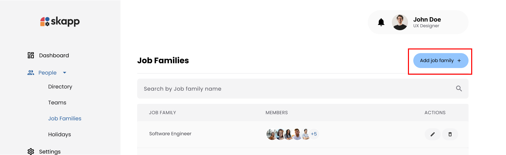

### Step 2: Enter Job Family Name

1. Enter a unique name for the job family.

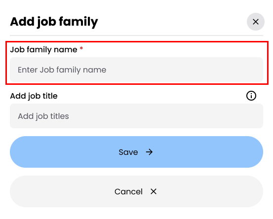

### Step 3: Add Job Titles

1. Use the **Job Titles** input field to add roles under the job family:

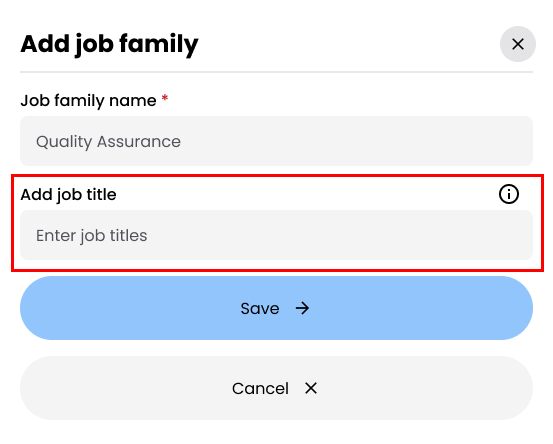

- Type the job title and press **Enter** or type a comma (",") to add multiple titles at once.

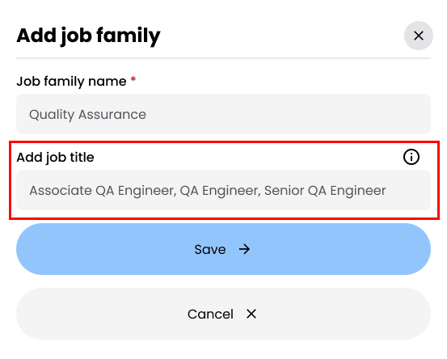

- Added job titles appear below the input field.
- Maximum of 50 characters per job title.

2. To remove a job title, hover over it and click the **Delete** icon.

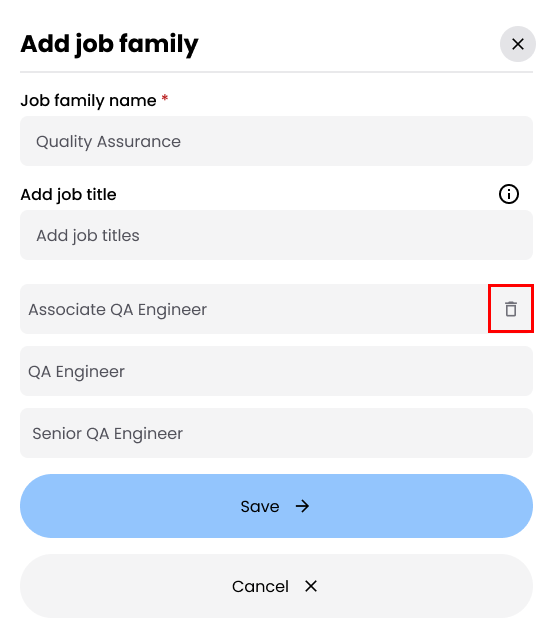

### Step 4: Save the Job Family

1. Click the **Save** button to create the job family.

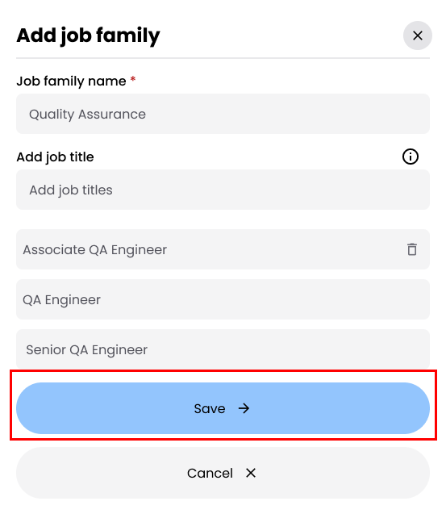

---

## Editing Job Titles

### Step 1: Open the Edit Job Family Modal

1. On the **Job Families** page, locate the job family containing the job title you want to edit.
2. Click the **Edit** button to open the **Edit Job Family** modal.

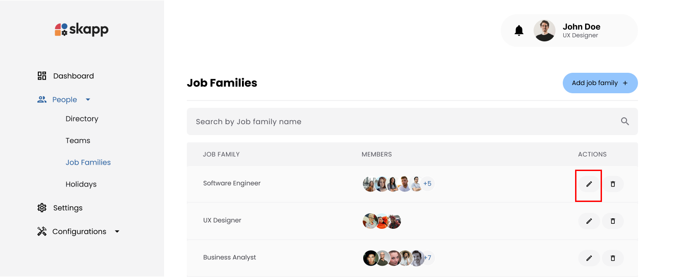

### Step 2: Modify Job Titles

1. Hover over the job title to display the **Edit** icon.
2. Click the **Edit** icon to enable inline editing.

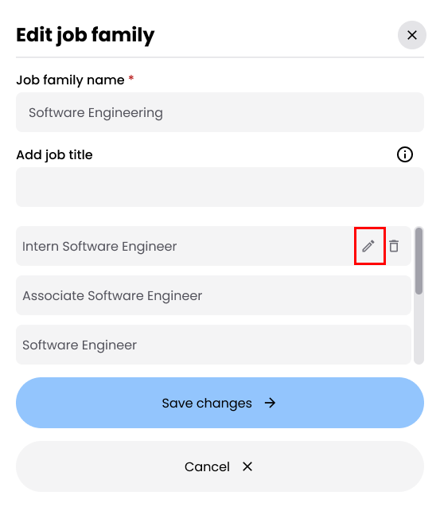

3. Make the necessary changes and click the **Confirm** icon (checkmark) to save the updated title.

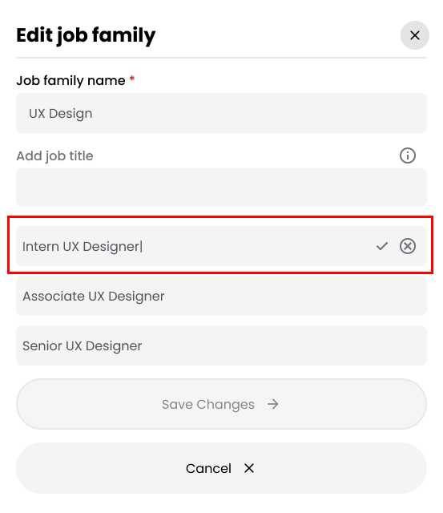

**If the job title has assigned members:**

- A confirmation modal appears, notifying that members will be reassigned to the new title.
- Click **Confirm and Procced** to confirm the changes

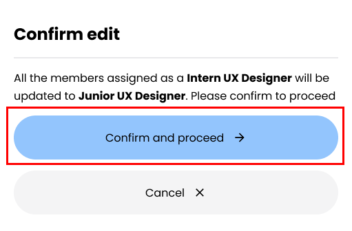

---

## Deleting Job Titles

### 1. Job Titles with No Assigned Members

1. In the **Edit Job Family** modal, hover over the job title to display the **Delete** icon.
2. Click the **Delete** icon.

3. Confirm the action in the **Confirmation Modal** by clicking **Delete Job Title**.

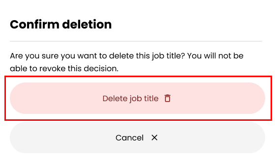

---

### 2. Job Titles with Assigned Members

1. In the **Edit Job Family** modal, hover over the job title to display the **Delete** icon.
2. Click the **Delete** icon.
3. Click the **Transfer Members** button
   - Assign each member to a new job title within the same job family using the dropdown menu.
   - Ensure all members have been reassigned.

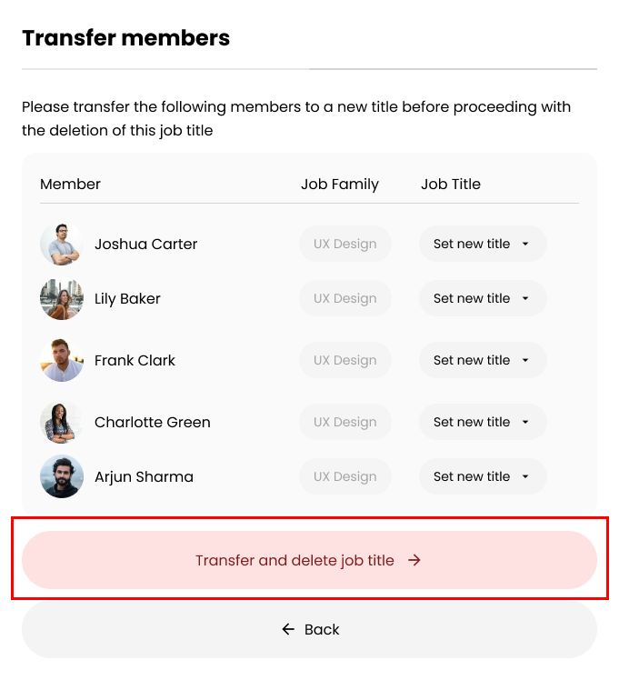

4. Click **Transfer and Delete Job Title** to complete the process.

---

## Deleting a Job Family

### 1. Job Families with No Assigned Employees

1. On the **Job Families** page, locate the job family you want to delete.
2. Click the **Delete** button.

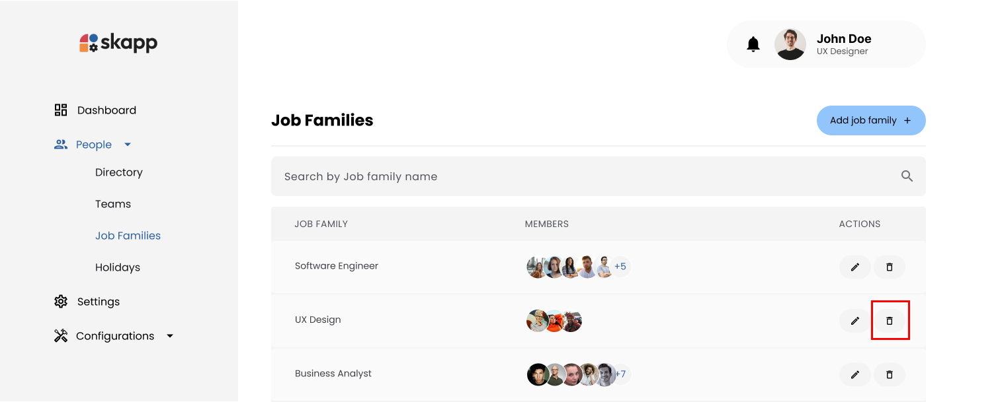

3. Confirm the deletion in the **Confirmation Modal** by clicking **Delete Job Family**.

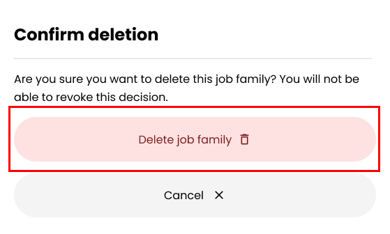

---

### 2. Job Families with Assigned Employees

1. On the **Job Families** page, locate the job family you want to delete.
2. Click the **Delete** button.
3. Click the **Transfer Members** button:

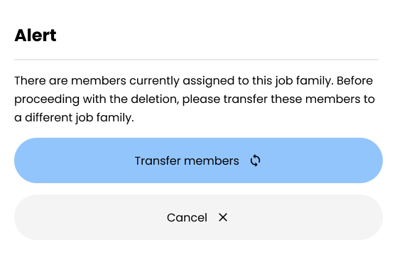

- Assign each employee to a new job family and job title:
  - **Select a New Job Family**: Choose a job family from the dropdown (excluding the one being deleted).
  - **Select a New Job Title**: Once a new job family is selected, the job title dropdown becomes enabled.

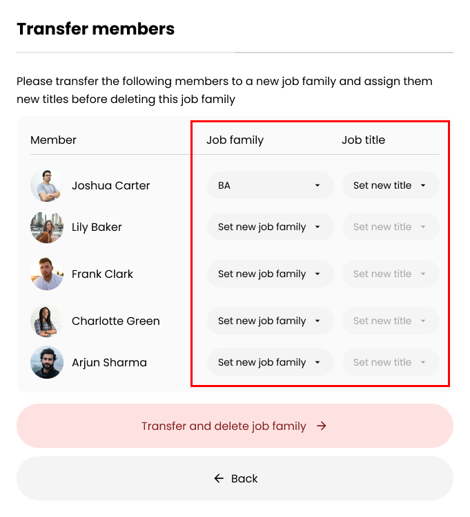

4. Click **Transfer and Delete Job Family** to complete the process.

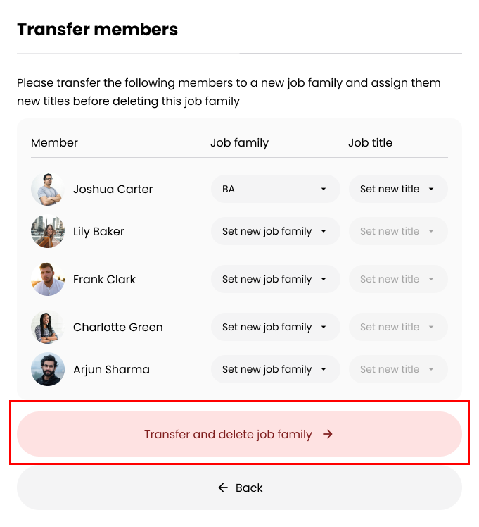

---

:::info

- **Career Progression Records**:
  - Deleted job titles or job families remain visible in employees' history timelines and career progression records.
  - The **Edit** button for records tied to deleted titles or families is disabled to prevent changes.

:::
