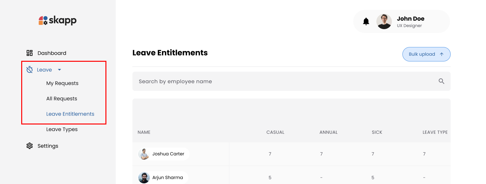
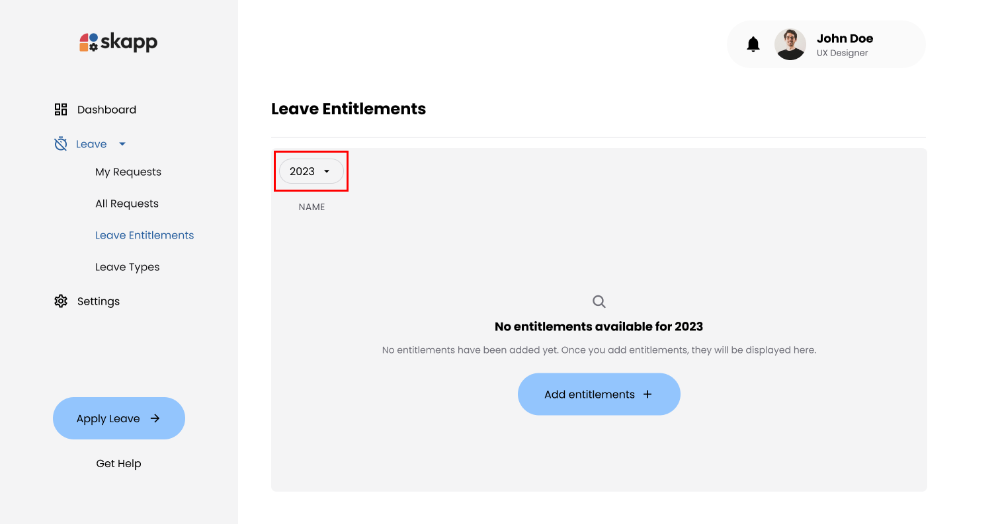
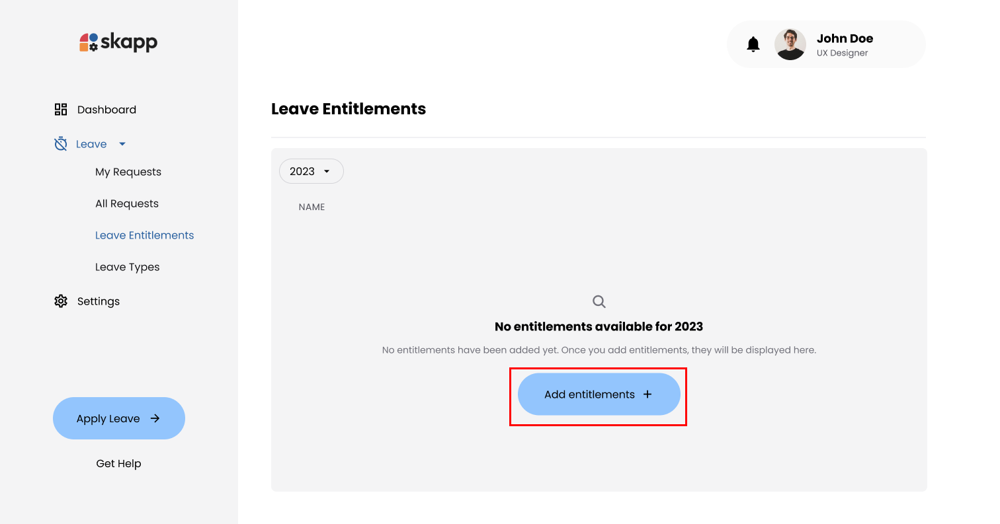
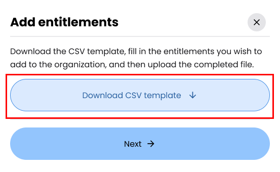
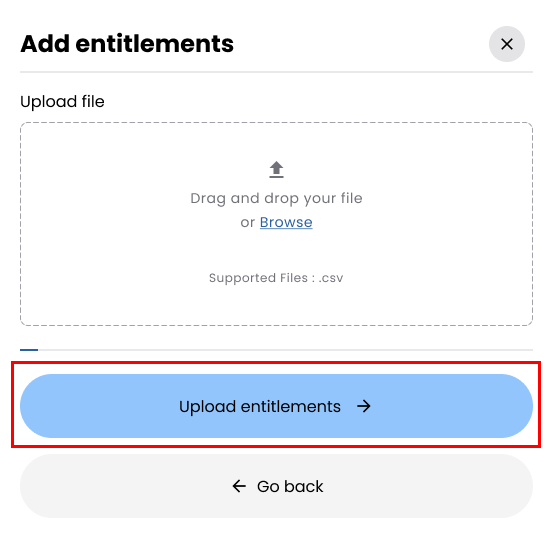
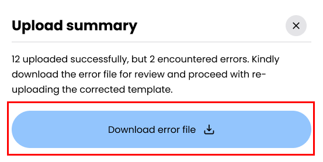
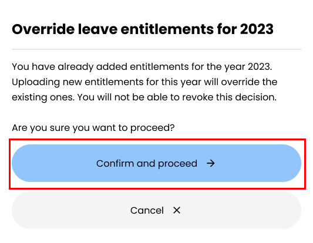

## Introduction

**Leave entitlements** represent the allocation of leave days assigned to each employee based on the organization’s policies Administrators can manage these entitlements by adding leave entitlements for individual employees. The system ensures accurate and flexible leave management through bulk operations and built-in validations, making it easy to upload or adjust entitlements using pre-defined templates.

---

## Accessing the Leave Entitlements Page

1. Click on the **Leave** option in the main navigation bar.
2. Click on the **Leave Entitlements** sub-menu option under the Leave module.

:::info

Users with the `Super Admin` & `Leave Admin` roles can manage leave entitlements.

:::

---

## Add Entitlements

### Step 1: Select the year

1. Select the year that you wish to add the entitlements.

### Step 2: Click on Add Entitlments Button

1. Click either the **Add Entitlements** button to open the **Add Entitlements Modal** page.

### Step 3: Download the CSV Template

1. Click the **Download CSV Template** button in the modal to download.

:::tip

The template includes specific columns to ensure proper formatting: **Employee ID**, **Employee Name**, and **Work Email**. Additionally, it features columns for each **active **[leave types](leave-types)** configured in the system**, such as Annual Leave and Sick Leave

:::

---

### Step 4: Upload the CSV File

1. Click **Next** in the Add Entitlements Modal.
2. Drag and drop the completed CSV file into the designated area or click to select the file manually.
3. Click **Upload Entitlements** after uploading the file.

:::warning[File Requirment]

- **Format**: CSV only.
- **Size**: Maximum 5MB.
- **Structure**: Must match the provided template, including correct column headings and order.

:::

- The system ensures the accuracy of uploaded data through comprehensive validations, such as verifying **employee details and leave type entries**.
- Any records that pass these validations are successfully uploaded to the system, while invalid entries are excluded. For transparency and easier corrections, an error log is generated detailing issues with the excluded records.

---

### Step 6: Handling Validation Errors

1. If records fail validations, an **Error Log (CSV)** is generated.
2. Click the **Download Error Log** button to download the file.

- The error log contains detailed information in columns such as Employee ID, Employee Name, Work Email, Leave Type, Entitlement Value, and a descriptive Error Message.
- After reviewing the errors, users are encouraged to correct the identified issues in their data and re-upload the file to ensure all records meet the validation criteria

---

## Overriding Entitlements

### Step 1: Navigate to Leave Entitlements

1. Follow the same steps as outlined in above.

### Step 2: Select the year

1. Select the year that you wish to add the entitlements.

### Step 3: Click on Add Entitlments Button

1. Click either the **Bulk Upload** button to open overidden condirmation page.

2. Click on the **Confirm and Proceed** button to open the upload modal.

### Step 4: Download CSV Template

1. Click the **Download Template** button in the Add Entitlements Modal.
2. Update the file with the new entitlement values.

:::info

To comapare the exsiting leave types you can export the the selected year currenct entitlments through **Export CSV** button.

:::

### Step 5: Upload the CSV File

1. Click **Next** in the Add Entitlements Modal.
2. Drag and drop the completed CSV file into the designated area or click to select the file manually.

:::warning

- New entitlement values must be **greater than or equal** to the employee's current utilization of the respective leave type.
- **Example**: If a user's current utilization for annual leave is 5 days, the new entitlement must be at least 5 days or greater to account for the days already taken

:::

---
