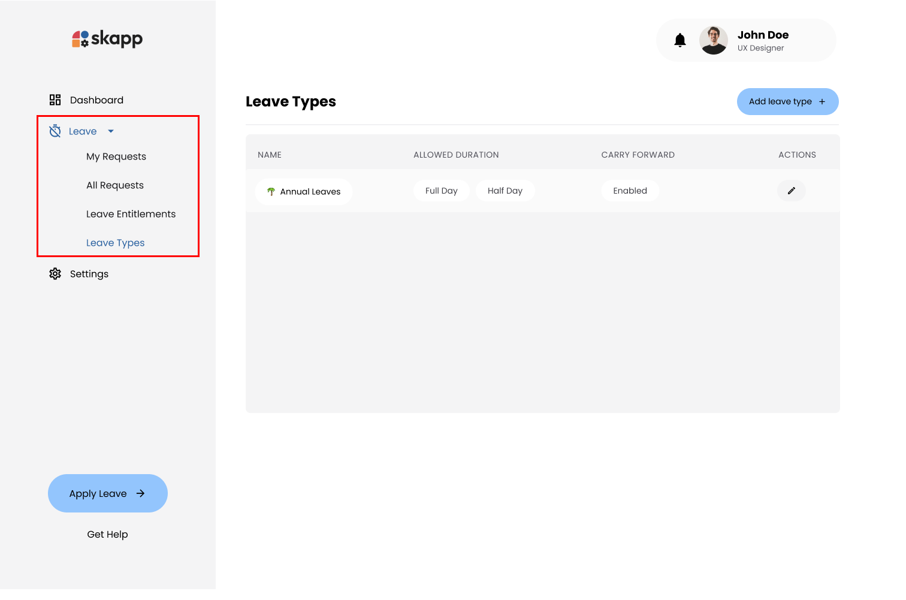
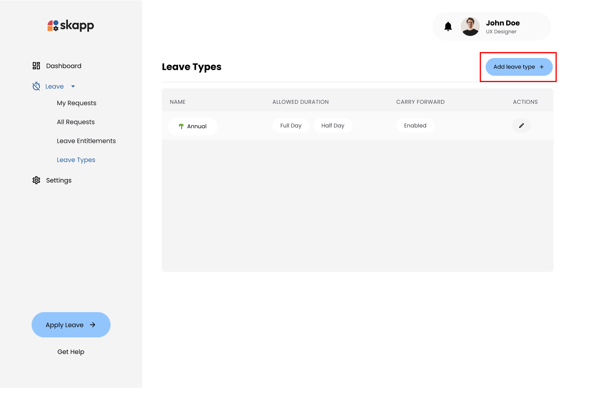
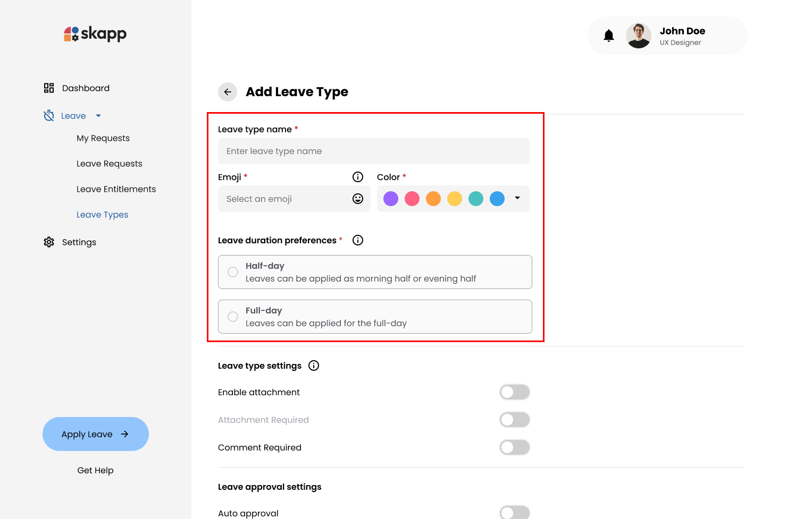
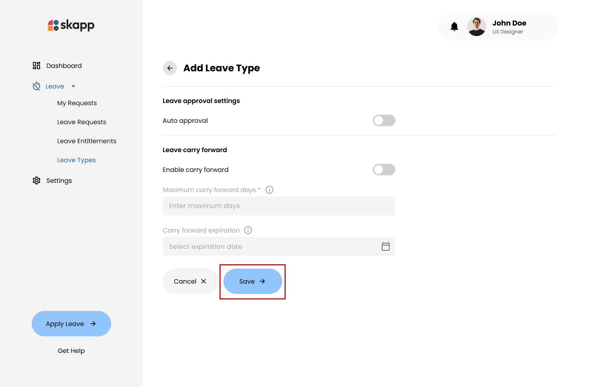
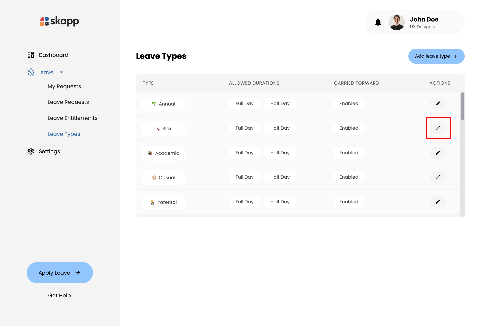

## Introduction

Organization can define, customize, and manage various **leave types** to align with organizational policies. This flexibility allows for tailored configurations, such as enabling attachments, setting carry-forward rules, and defining leave duration preferences.

---

## Accessing the Leave Types Page

- Click on the **Leave** option in the main navigation bar.
- Click on the **Leave Types** sub-menu option under the Leave module.

:::info

Users with the `Super Admin` & `Leave Admin` roles can manage leave types.

:::

---

## Adding Leave Types

### Step 1: Click on Add Leave Type Button

- On the **Leave Types** page, click the **Add Leave Type** button to open the **Add Leave Type** page.

### Step 2: Enter Leave Type Details

#### Leave Type Name

- Mandatory field
- The name of the leave type as it will appear throughout the system.
- Must be unique within the organization.

---

#### Emoji

- Mandatory field
- Click on the Emoji icon to open a dropdown.
- Choose an emoji that best represents the leave type.

---

#### Color

- Mandatory field
- A color code for visual distinction in analytic graphs.
- Select one of the 12 available colors.

---

#### Leave Duration Preference

- Mandatory field
- Specifies whether the leave type can be taken as full days, half days, or both.
  - **Full Day**: Leave can only be applied for full days.
  - **Half Day**: Leave can only be applied for half days.
  - **Both**: Leave can be applied for either full or half days.

---

#### Enable Attachment

- Optional field
- Enabling Allows employees to attach documents when applying requests for this leave type.

---

#### Attachment Required

- Optional field
- Specifies whether attaching a document is mandatory.
- Enabled only if **Attachments are enabled**.

---

#### Comment Required

- Optional field
- Requires employees to add a comment or note.

---

#### Auto Approval

- Optional field
- Automatically approves leave requests of this type.

---

#### Enable Carry Forward

- Optional field
- Allows unused leave days to be carried over to the next leave cycle.

:::note
Check **[Leave Carry Foraward](leave-carry-forward.md)**
:::

---

#### Maximum Carry Forward Days

- Mandatory field only if carry forwarding is enabled.
- Sets the maximum number of unused leave days to carry forward.

---

#### Carry Forward Expiration

- Mandatory field only if carry forwarding is enabled
- Defines the expiration date for carried forward leave days.

---

### Step 3: Save the Leave Type

- The **Save** button remains disabled until all mandatory fields are filled.
- Click the **Save** button to create the leave type.

---

## Editing Leave Types

### Step 1: Click on Edit Leave Type Button

- On the **Leave Types** page, locate the leave type you wish to edit.
- Click the **Edit** option under the **Action** column.

### Step 2: Edit Leave Type Details

- Modify the details as needed, following the same guidelines as when **[Adding a leave type](leave-types#adding-leave-types)**.

:::info

- Changes to **Leave Type Name**, **Emoji**, and **Color** will reflect in existing leave requests.
- Changes to **Attachment** or **Comment Settings** apply only to future requests.
  :::

---

## Deactivating a Leave Type

- Deactivating a leave type makes it unavailable for future leave requests.
- Users won't be able to see the leave type cards in the **[My allocation](manage-your-leaves#my-leave-allocation)** section if they had entitlements under the deactivated leave type.

### Step 1: Deactivate Leave type

- Toggle the **Active/Inactive** switch to **Inactive**.

- Click the **Save** button.

### Step 2: Confirm Deactivation

- Click on **Confirm and Save** butoon to deactive the leave type.

---

## Activating a Leave Type

- Reactivating a leave type makes it available again for requests if they have entitlments for that leave type.

### Step 1: Reactivate Leave type

- Toggle the **Active/Inactive** switch to **Active**.
- Click the **Save** button.

### Step 2: Confirm Deactivation

- Click on **Confirm and Save** butoon to reactivate the leave type.

---
