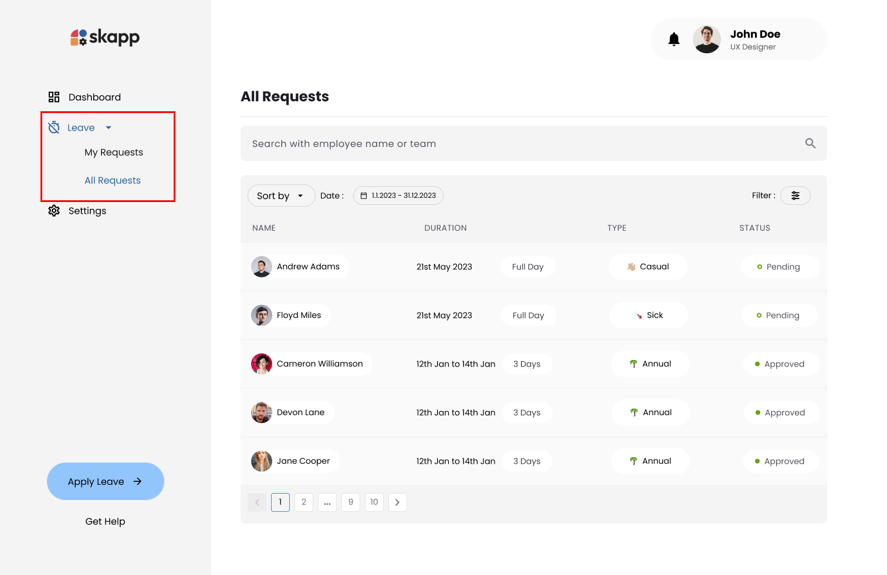
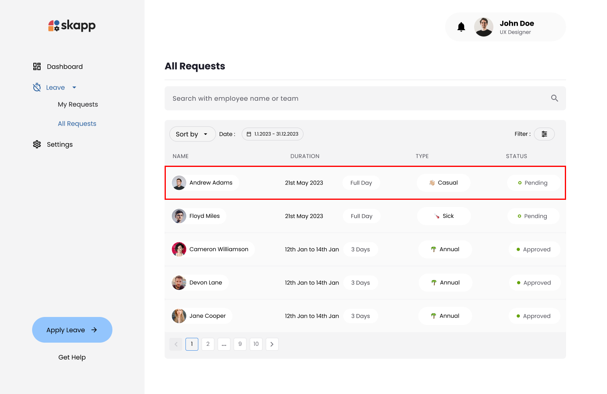
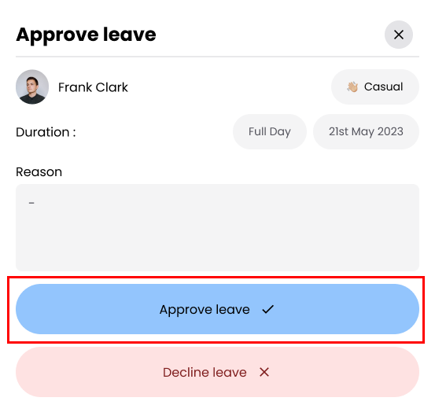
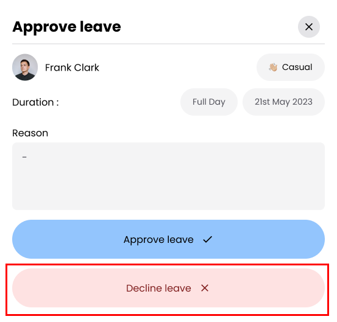
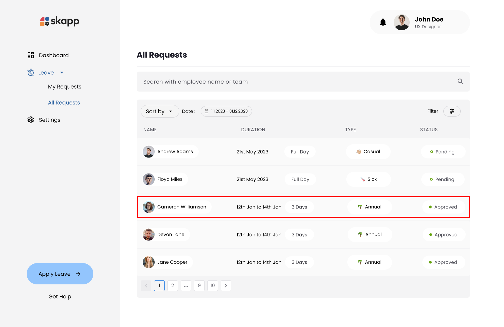
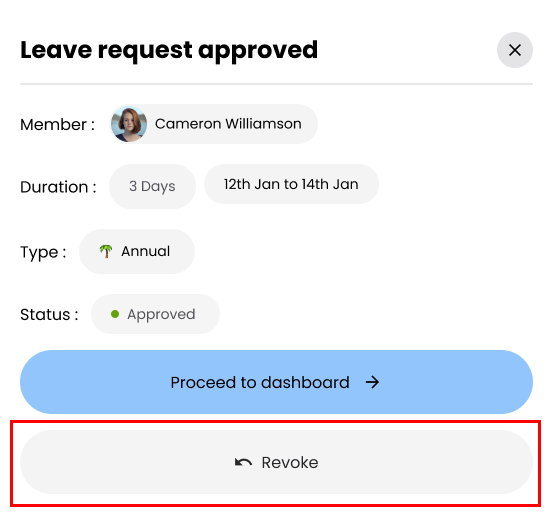

# Approve Leave Requests

## Introduction

Managing leave requests involves reviewing the details of employee submissions and deciding whether to approve or decline them. This process helps ensure that all leave requests are handled systematically and with due consideration.

Approving a leave request adds it to the employee's leave record, while declining provides an opportunity to communicate the reasons for rejection, ensuring transparency and clarity

---

## Accessing Leave Requests page

1. Click on the **Leave** option in the main navigation bar.
2. Click on the **All Requests** sub-menu option under the Leave module.

:::info

Users with the `Super Admin`,`Leave Admin` & `Leave Manager` roles can manage leave request approval and declining.

:::

---

## Approving a Leave Request

### Step 1: Click on a Pending Leave Request

1. In the **Status** column, find requests marked as Pending.
2. Click on the specific request you wish to approve.

### Step 2: Approve the Request

1. Review the details of the leave request in the modal.
2. Click the **Approve Leave** button at the bottom of the modal.

---

## Declining a Leave Request

### Step 1: Click on a Pending Leave Request

1. In the **Status** column, find requests marked as Pending.
2. Click on the specific request you wish to decline.

### Step 2: Click on Decline the Request Button

1. Review the details of the leave request in the modal.
2. Click the **Decline Leave** button.

### Step 3: Enter Reason for Declining

1. Enter a comment explaining the reason for declining the request.
2. Click the **Decline Leave** button.

---

## Revoking an Approved Leave Request

### Step 1: Locate the Approved Request

1. In the **Status** column, find requests marked as Approved.
2. Click on the specific request you wish to revoke.

### Step 2: Click on Revoke Request Button

1. Review the details of the leave request in the modal.
2. Click the **Revoke** button.

:::warning

Revoking an approved leave request means canceling or withdrawing a leave that has already been approved, ensuring it is no longer valid, and the leave balance is updated accordingly.

:::

---
