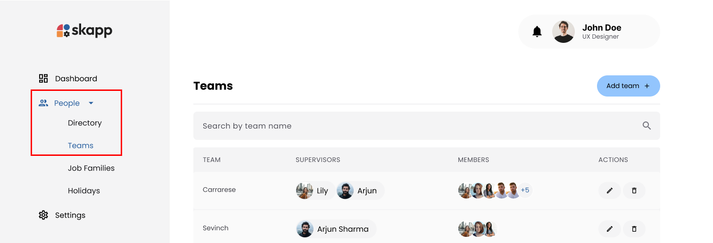
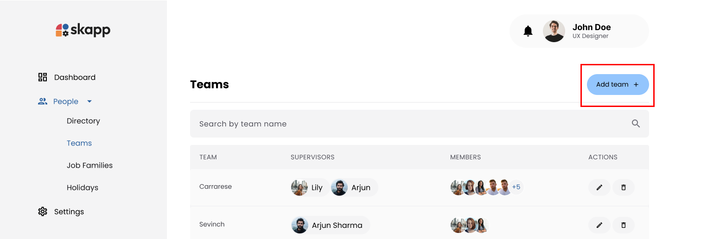
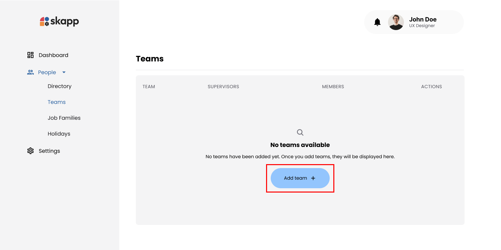
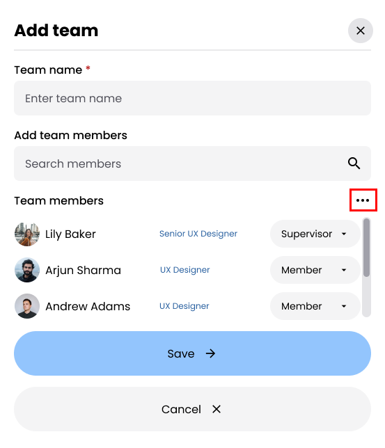
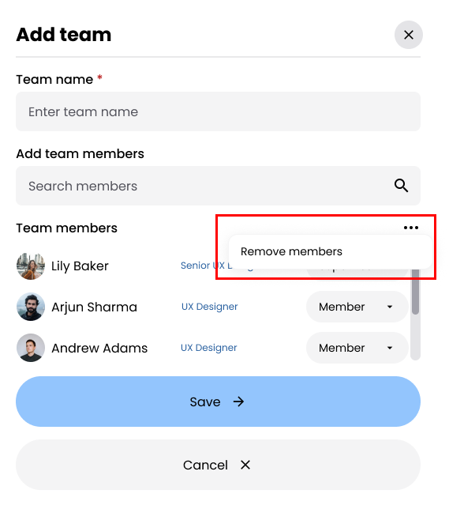

## Introduction

Teams in Skapp provide a structured way to organize employees into groups for streamlined management and collaboration. With this feature, administrators and managers can easily create, edit, and delete teams, assign roles, and manage team memberships.

---

## Accessing the Teams Page

- Navigate to the **People** option in the main navigation bar.
- Click on the **Teams** submenu option.

:::info

- Users with the `Super Admin`,`People Admin` roles can manage teams.
- Users with the `People Manager` role can only view teams.

:::

---

## Adding a Team

### Step 1: Click the Add Team button

- On the **Teams** page, click the **Add Team** button to open the **Add Team** modal.

---

### Step 2: Enter Team Name

- The team name must be unique across the organization.

---

### Step 3: Add and Remove Team Members

#### Adding Team Members

- Use the **search bar** to find and **select employees** to add to the team.
- Added members appear in a list within the modal.

## 

#### Removing Members

- Click on the three dots (options menu) in the modal.

- Select **Remove Members** to enable selection mode, Checkboxes appear next to each member.
  

- Select the members you wish to remove.
- The **Save** button changes to **Remove Members**.
- The **Remove Members** button is disabled until at least one member is selected.
- Click **Remove Members** to remove the selected members from the team.

---

### Step 4: Assigning Roles

- For each member, select a role from a dropdown menu.
- **Roles include**: `Supervisor` and `Member`.
<!--
 -->

:::warning[Supervisor Limitation]

- **Minimum Supervisors**: At least one supervisor is required per team.
- **Maximum Supervisors**: Up to 3 supervisors can be assigned to a team.
  :::

---

### Step 5: Save the Team

- Click the **Save** button to create the team.

<!--  -->

---

## Editing a Team

### Accessing the Edit Team Modal

1. On the **Teams** page, locate the team you wish to edit.
2. Click the **Edit button** for the team you wish to edit and open the **Edit Team** modal.

<!--  -->

- The process of editing a team is similar to adding a team. You can modify the team name and manage team members

---

## Deleting a Team

### Step 1: Accessing the Delete Option

- On the **Teams** page, locate the team you wish to delete.
- Click the **Delete icon** for the team you wish to delete.

<!--  -->

- An alert prompts the user to either **Reassign Team Members** or **Proceed to Delete**.

#### Options:

- **Reassign Team Members**: Opens the **Reassign Team Members** modal.
- **Proceed to Delete**: Deletes the team from the system.

---

### Step 2: Reassigning Team Members

- Click **Reassign Team Members** to open the modal.

<!--  -->

- The dropdown lists all other teams in the system.
- **Select a new team** for each member as desired.
- Assigning new teams is optional for each member.

---

### Step 3: Proceeding to Delete

- Click **Proceed to Delete** after reassigning members.
- The system reassigns members to the selected teams and deletes the original team.

<!--  -->

:::warning[Important]

- When members are reassigned, they are automatically assigned the **Member** role in the new teams.
- Changes are recorded in each employee's history timeline.
- Deleted teams remain visible in history records for reference.

:::
