## Introduction

The **Manual Time Entry** feature in **Skapp** allows users to add or edit their work hours manually. This is particularly useful for correcting missed clock-ins or clock-outs or adjusting work hours due to unforeseen circumstances. Accessible from the **My Timesheet** page, this feature ensures that users maintain accurate attendance records.

---

## Accessing Manual Time Entry

### Navigate to My Timesheet

**Users with "Employee" user role in the Attendance Module**

- Access **My Timesheet** directly from the main navigation bar.

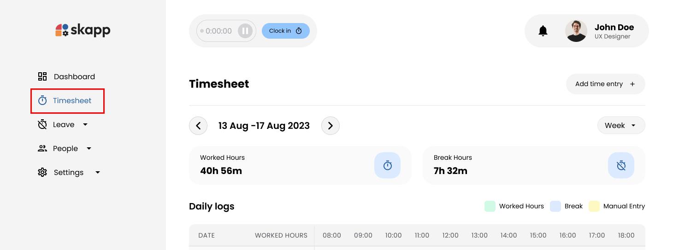

**Users with "Super Admin","Attendance Admin or Attendance Manager" user roles**

1. Navigate to the **Timesheet** submenu in the main navigation bar.
2. Click on **My Timesheet**.

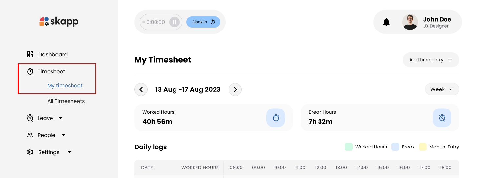

---

## Adding a Manual Time Entry

### Step 1: Open the Add Time Entry Modal

- On the **My Timesheet** page, click the **Add Time Entry** button.

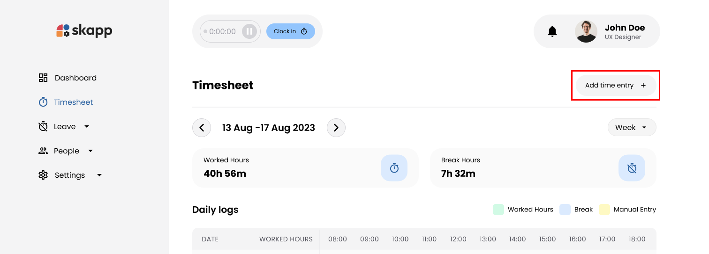

---

### Step 2: Select Date

- Click on the **Date** field to open the calendar.
- Select the date for which you want to add a time entry.

#### Important :

- **Current Day Restrictions**
  - If you have not clocked in and clocked out for the current day, the current day is disabled until you do so.
  - The system highlights the previous day if you have not clocked in and clocked out.
  - The system highlights the current day if you have clocked in and clocked out.
- **Date Range**
  - Only dates within the current year can be selected.
- **Leave and Holidays**
  - The calendar displays existing leave requests and company holidays.
  - Be cautious when selecting a date that falls on a leave day or holiday; the system will prompt you accordingly.

---

### Step 3: Enter From and To Times

#### From Time (Start Time)

- Click on the **From Time** field to open the time selector.
- Set the start time of your workday. The default time is the organization's standard work start time.

#### To Time (End Time)

- Click on the **To Time** field to open the time selector.
- Set the end time of your workday. The default time is the start time plus the organization's standard work hours per day.

#### Important:

- The **From Time** must not be later than the **To Time**.
- Use the clock component to select hours and minutes by dragging the pointer.
- Choose between **AM** and **PM**; selected parts (hours, minutes, AM/PM) are highlighted for clarity.

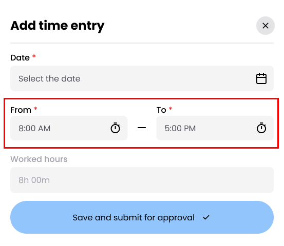

---

### Step 4: Review Worked Hours

- The **Worked Hours** field is automatically calculated based on the **From** and **To** times.
- This field is read-only and updates dynamically as you adjust the times.
- Ensure that the **Worked Hours** accurately reflect the time you worked.

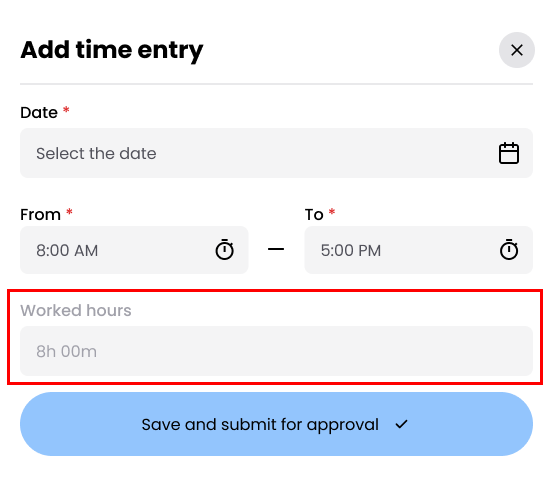

---

### Step 5: Submit the Time Entry

- Click the **Save and Submit for Approval** button to submit your time entry.

:::warning[Important]

- Upon submission, the time entry is sent to your primary and secondary supervisors for approval.

:::

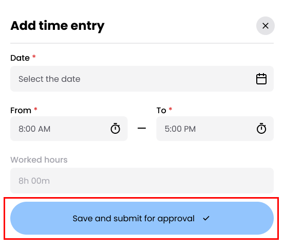

---

## Special Scenarios

### Pending Time Entry Request Exists

- If a pending time entry request exists for the selected date, you are not allowed to submit an another entry for that date untill exisiting time entry get approved or declined.

---

### Existing Time Entry for Selected Date

- If a time entry already exists for the selected date, a confirmation modal appears indicating that an entry exists.
  - **Options**:
    - Click the **Confirm** to save and submit the entry
    - Click the **Cancel** to Close the modal and return to the previous state.

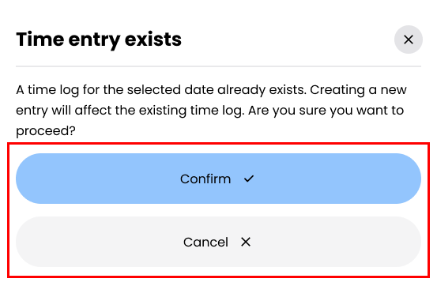

---

### Time Entry on a Leave Day

- If you have applied for a leave request for the selected date, a confirmation modal appears informing you about the leave.
  - Click the **Confirm** to save and submit the entry.
  - Click the **Cancel** to Close the modal and return to the previous state.

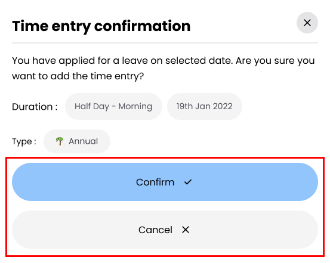

---

## Editing a Time Entry

### Step 1: Open the Edit Time Entry Modal

- On the **My Timesheet** page, click on a day that has a logged time.

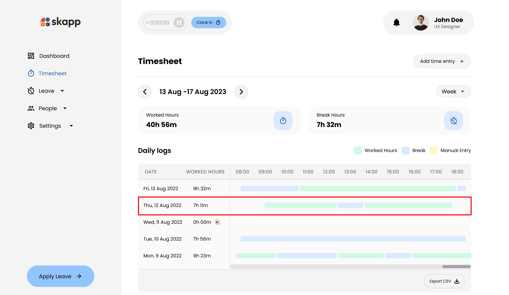

- This action opens the **Edit Time Entry** modal.

---

### Step 2: Modify Times

#### Clock In Time:

- Click on the **Clock In Time** field and adjust the time using the time selector.

#### Clock Out Time:

- Click on the **Clock Out Time** field and adjust the time using the time selector.

:::warning[Important]

- The **Clock In Time** must not be later than the **Clock Out Time**.
- The **Worked Hours** field updates automatically based on your changes.
- Break Hours remain unchanged and are displayed as read-only.
- The **Save and Submit for Approval** button is enabled only if changes have been made to the time fields.

:::

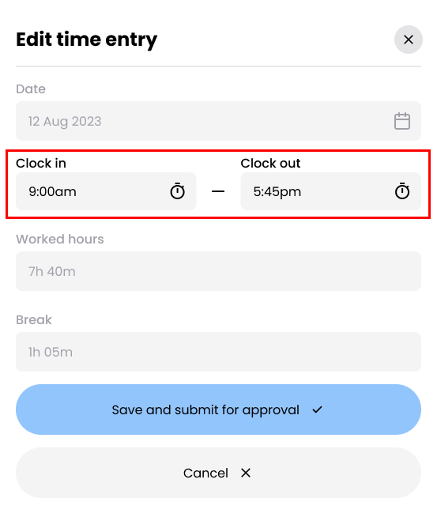

---

### Step 3: Submit the Edited Time Entry

- Click the **Save and Submit for Approval** button to submit your changes.
- Changes are sent to your primary and secondary supervisors for approval.

:::warning[Important]

- If you have an ongoing time entry you are not allowed to edit that time entry.
  :::

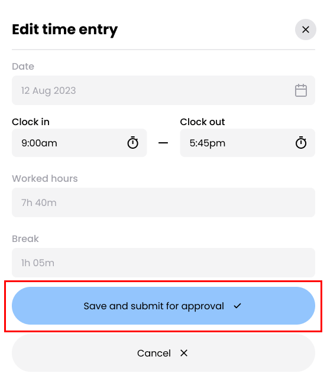

---

## Canceling a Time Entry Request

### Step 1: Locate the Pending Request

- On the **My Timesheet** page, navigate to the **Time Entry Requests** section.

### Step 2: Cancel the Request

1. Click on the **kebab menu** (three vertical dots) for the pending request.

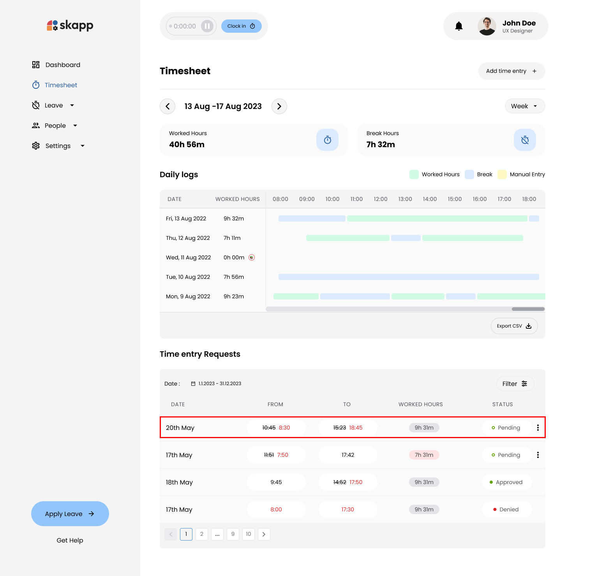

2. Select the **Cancel** option from the dropdown menu.

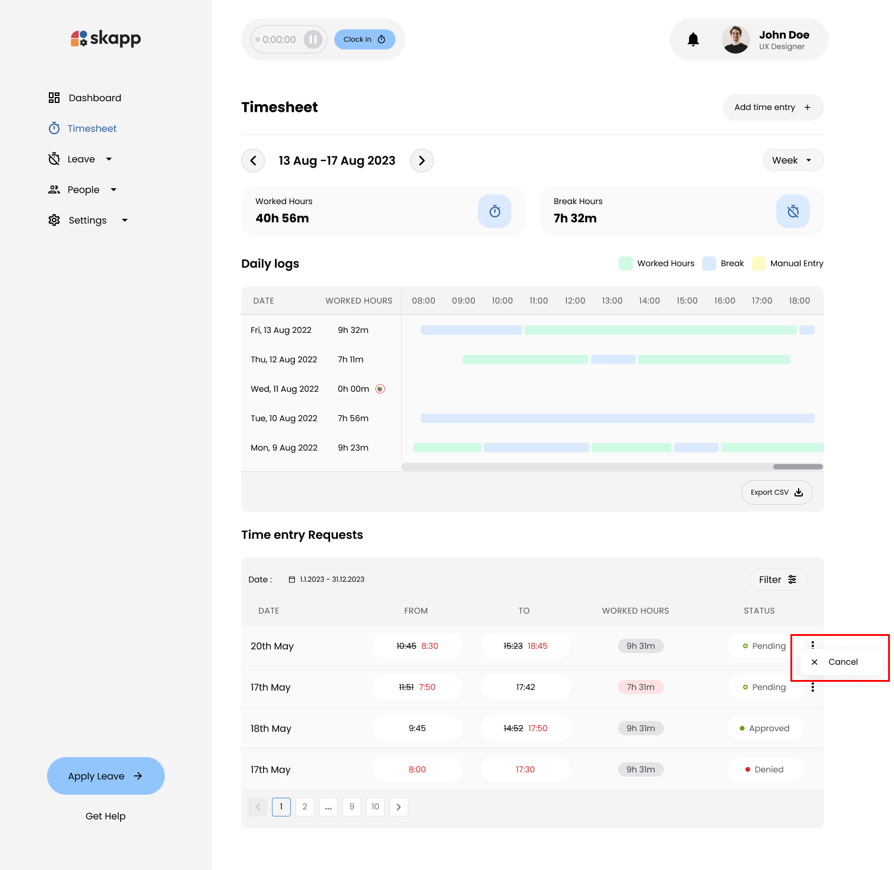

:::warning[Important]

- Only pending requests can be canceled.
- Once canceled, the request status updates to **Cancelled**.
- Canceled requests cannot be edited or resubmitted; you must create a new request if needed.

:::
