## Introduction

This guide provides a comprehensive walkthrough for adding, managing, and terminating users in the system. From configuring personal and employment details to handling terminations, these steps ensure accurate and secure user data management.

---

## Accessing the Directory Page

:::info

- Users with the `Super Admin` and `People Admin` roles can add users to the system.
- Users with the `People Manager` role can only view the add users through directory.

:::

1. Navigate to the **People** option in the main navigation bar.
2. Click on the **Directory** sub-menu option.

## Adding Users (Quick Add)

### Steps 1: Click on Add People Button

1. Click the **Add People** button to open the **Add People Modal**.

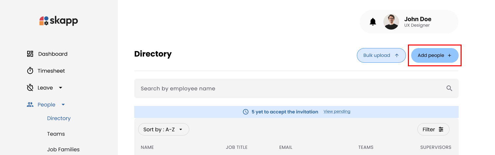

---

### Steps 2: Enter User Information

1. Fill in the mandatory fields.

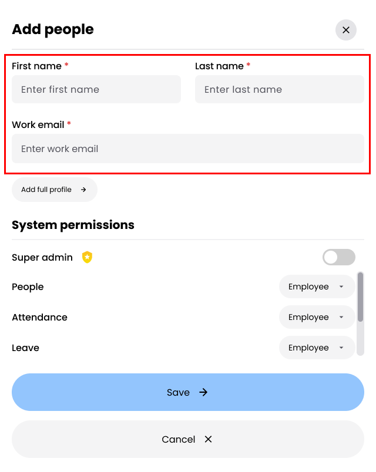

- **First Name** and **Last Name**: Required to identify the user in the system.
- **Work Email**: This serves as the **unique identifier** and will be used as the **username** for logging into the system. Ensure the email is valid and not duplicated.

2. Set user permissions

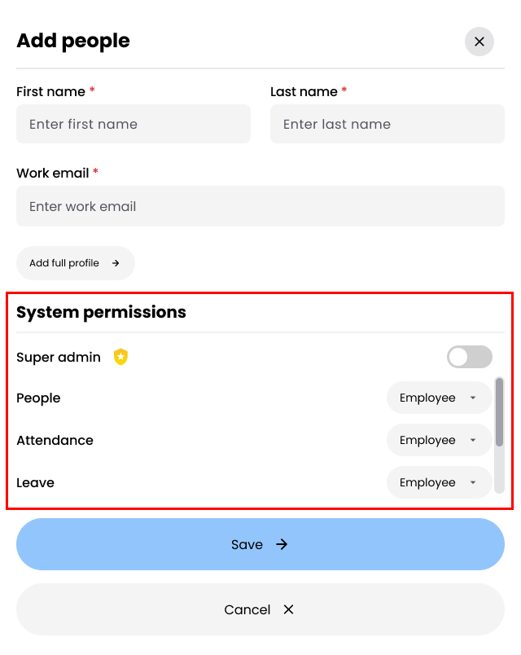

- Default role is **Employee** across all modules.
- Selecting **Super Admin** automatically assigns admin permissions for all modules.

<!-- :::note[See Also]
Check **[User Roles](user-roles-permissions)**
::: -->

---

### Steps 3: Save the User

1. Click **Save** to create the user.
2. The **Share Credentials Modal** appears with:
   - **Account URL**: The login page link.
   - **Username**: The user's work email.
   - **Password**: A temporary password.

---

### Steps 4: Share Credentials

1. Click **Copy Text** to copy the credentials for sharing with the user.

:::info

Click **Add Full Profile** to proceed to the add more details realted to the user.

:::

---

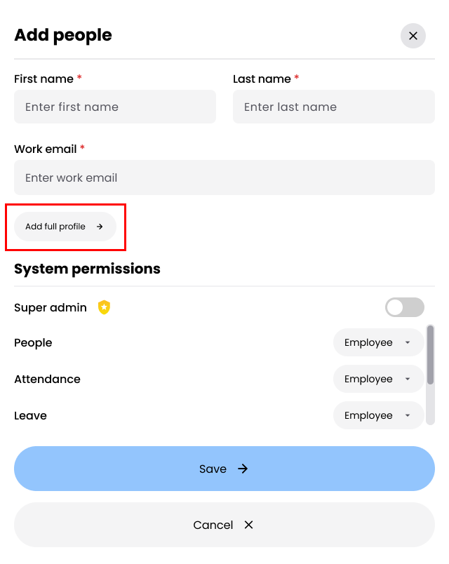

## Adding Users with Full Profile

The full profile process consists of five sections:

1. **Personal Details**
2. **Emergency Details**
3. **Employment Details**
4. **System Permissions**
5. **Entitlement Details**

Users must complete each section in sequence and click **Next** to proceed to the next step.

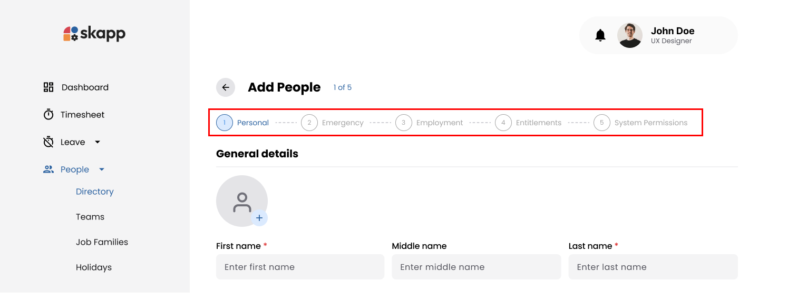

---

### Step 1: Personal Details

- The **Personal Details** section collects general and contact information about the employee.
- First name and last name fields are mandatory

---

### Step 2: Emergency Details

The **Emergency Details** section allows administrators to store primary and secondary emergency contact information.

---

### Step 3: Employment Details

The **Employment Details** section records organizational and employement-specific information.

### Work Email

- Mandatory

:::danger[Important]

- This **work email** address and password will be used as the username for the user to logging into the system.
- This work email won't be able to edit after user loginto the application for the first time.

:::

---

### Primary and Secondary Supervisors

- Primary and secondary supervisors that will be assigning to the user will be getting all the leave and time request related to that user for approving and declining.
- Secondary supervisor field will be disabled untill user select a primary supervisor.

:::danger[Important]

- To recieve leave requests user should be assigned as a `Leave Admin` or `Leave Manager`.
- To recieve time entry requests user should be assigned as an `Attendance Admin` or `Attendance Manager`.

## :::

### Assigning Teams

- User have the felxibility to assign multiple teams for an employee.
- Use the dropdown to assign the employee to one or more teams.
- If a team doesn’t exist, click the **Add New Team** link to create and assign a new team.

---

### Career Progression

#### Following fields need to be complete to add a career progression record.

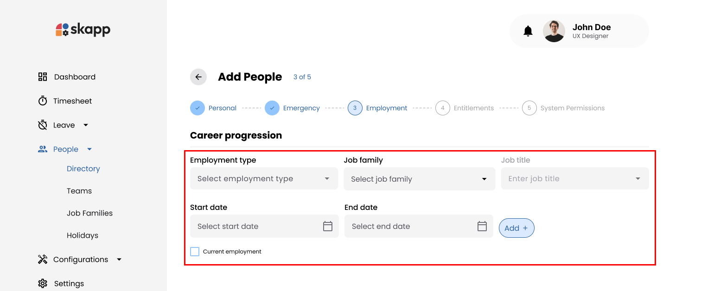

1. **Employment Type**

   - Select from dropdown options:
     - **Intern**
     - **Permanent**
     - **Contract**
   - Placeholder: _Select employment type_

2. **Job Family**

   - Select a job family from the dropdown.
   - **Add Job Family**: If the required job family does not exist:
     - Click the **Add Job Family** option at the end of the dropdown list.
     - The system opens the **Add Job Family** modal.
     - Upon saving, the new job family is pre-selected in the dropdown.

3. **Job Title**

   - This field is enabled only after selecting a job family.
   - Select a job title from the dropdown.
   - **Add Job Title**: If the required job title does not exist:
     - Click the **Add Job Title** option at the end of the dropdown list.
     - The system opens the **Add Job Title** modal.
     - Upon saving, the new job title is pre-selected in the dropdown.

4. **Start Date**

   - Specify the start date for the job role using the date picker.
   - Placeholder: _Select start date_

5. **End Date**

   - Specify the end date for the job role using the date picker.
   - If the role is marked as the current employment, the end date field is disabled.
   - Placeholder: _Select end date_

6. **Current Employment**
   - Use the checkbox to mark the record as the employee's current role.
   - If selected, the end date field is disabled.

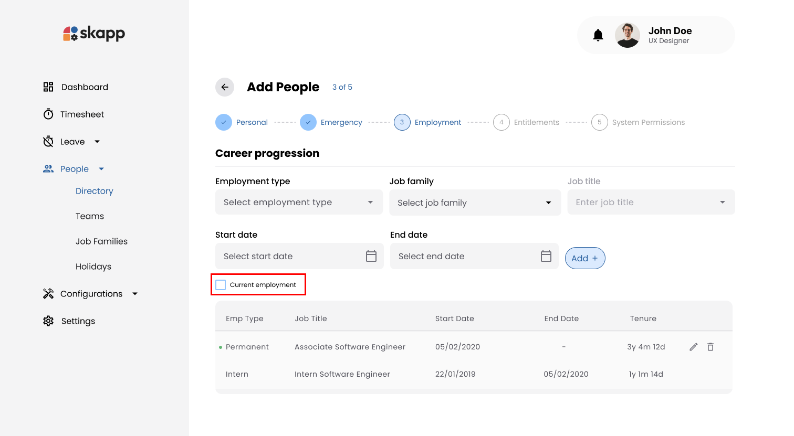

#### Adding a Career Progression Record

1. Fill in all the required fields as described above.
2. Click the **Add** button.

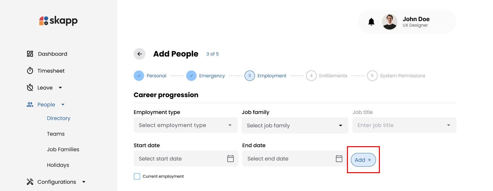

3. Upon successful addition:
   - The record is displayed in a table below the form.
   - All input fields are cleared, ready for the next entry.

---

#### Editing Career Progression Records

1. Locate the record in the table.
2. Click the **Edit** button next to the desired record.

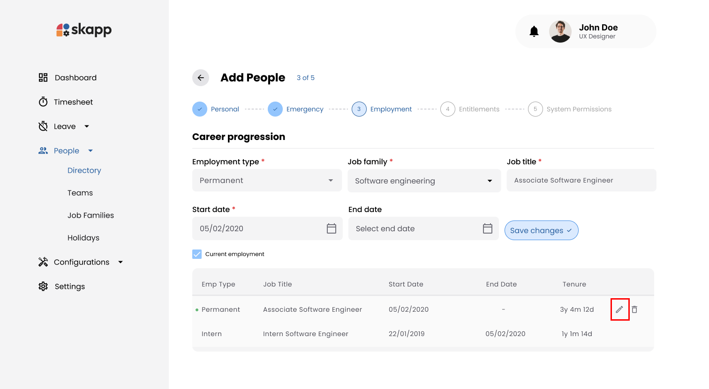

3. The record's details will populate the input fields.
4. Modify the details as needed.
5. Click **Save Changes** to update the record.

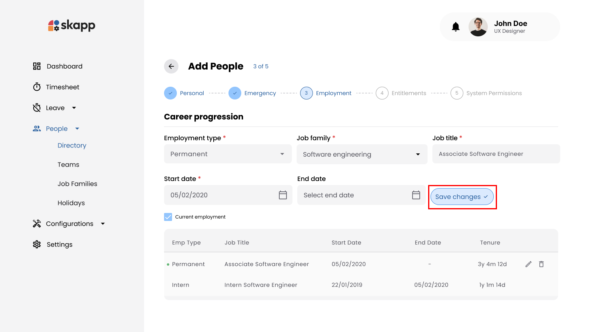

---

#### Deleting Career Progression Records

1. Locate the record in the table.
2. Click the **Delete** button next to the desired record.
3. The record will be removed from the table.

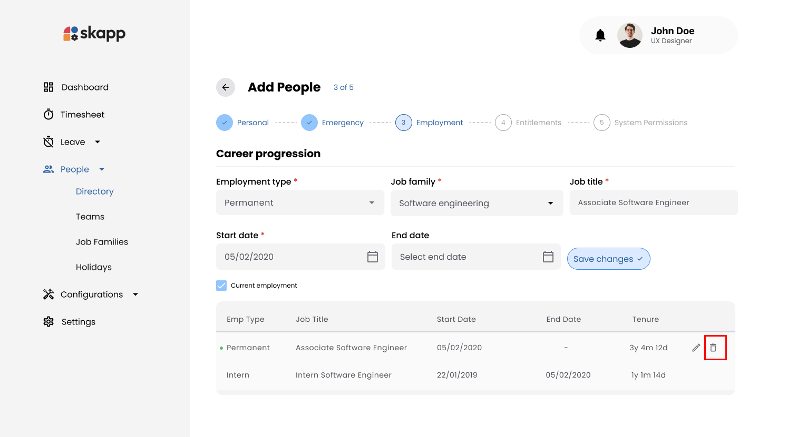

---

### Step 4: System Permissions

The **System Permissions** section determines the user’s access level for various modules.

#### Role Assignment

- By default, all modules are set to the **Employee** role.
- Modify roles for each module by selecting from options like Employee, Manager, or Admin.

#### Super Admin Permission

- Toggle the **Super Admin** option to grant full administrative access.
- Enabling this option automatically assigns the Admin role for all modules and locks further changes to module-specific roles.

---

### Step 5: Entitlement Details

The **Entitlement Details** section allows administrators to assign leave entitlements for the employee.

#### Adding Leave Entitlements

1. Select the **Year** for which the entitlement applies.
2. Choose the **Leave Type** from the dropdown.
3. Specify the **Number of Days** allocated for the leave.
4. Define the **Effective From** and **Expiration Date** for the entitlement.

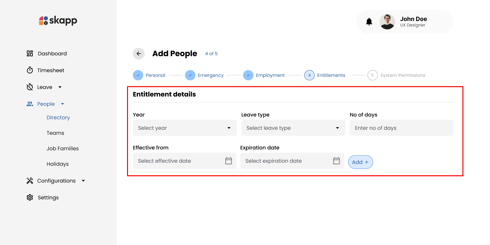

#### Adding Multiple Entitlements

- Click the **Add** button to save the entry.

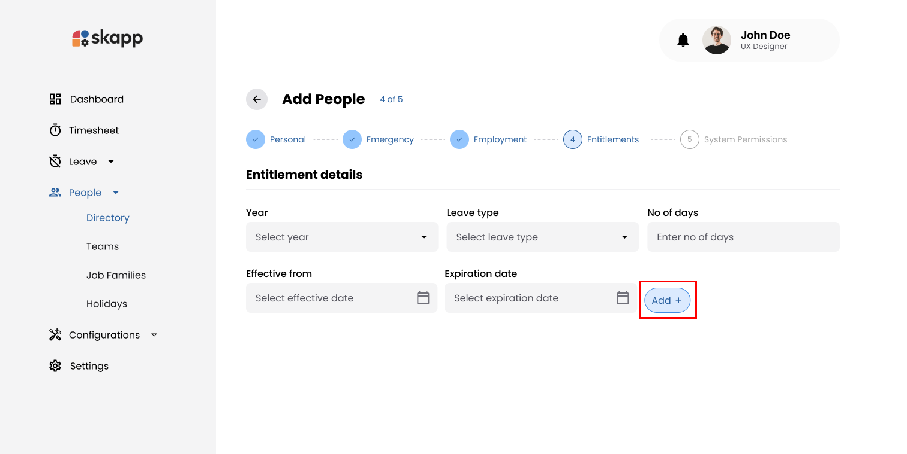

- The entitlement appears in a table below the form.
- Repeat the process to add multiple entitlements.

:::warning[Important]

- Multiple records for the same leave type will be merged into a single record with the cumulative number of days, provided the effective and expiration dates are the same.

:::

#### Delete Added Entitlements

- Click the Edit icon next to an entitlement to modify details.

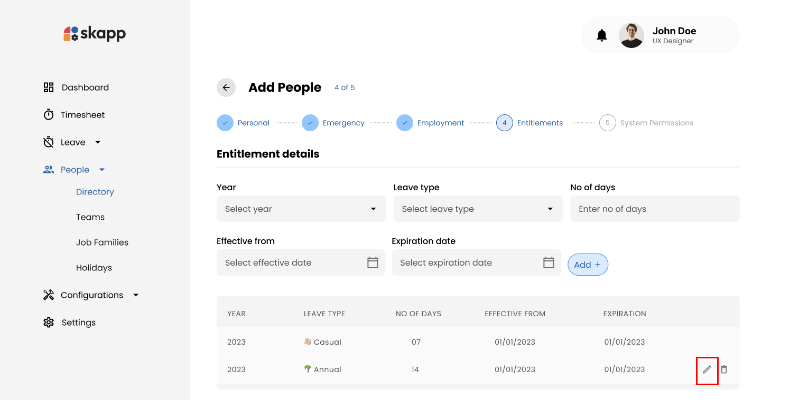

- Click on the save changes button when modifying is done.

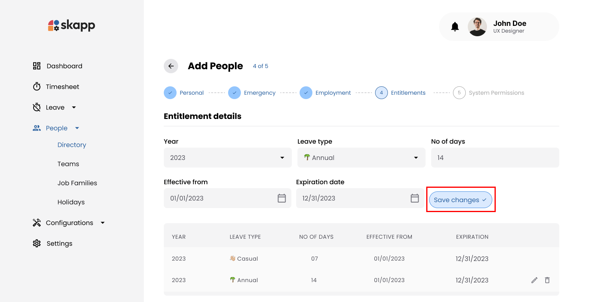

- Click the Delete icon to remove the entitlement from the list.

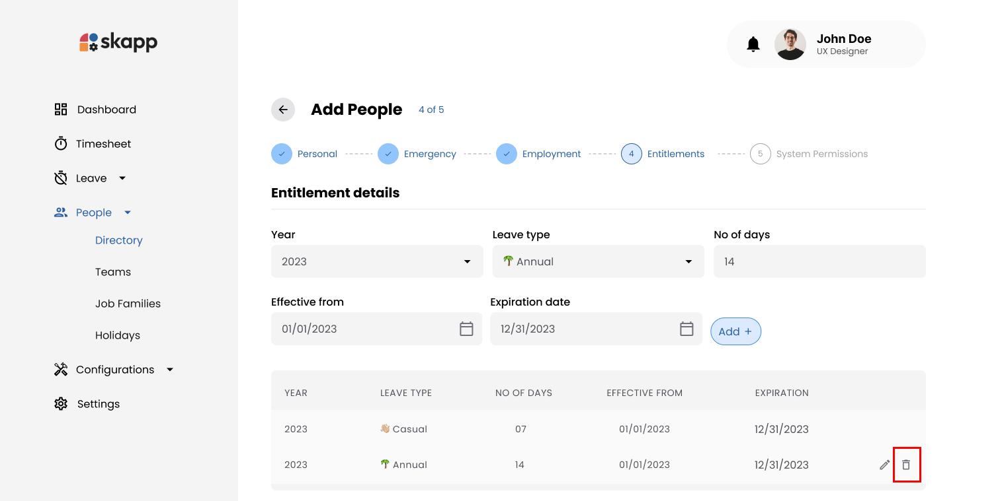

---

### Step 6: Save the User

After completing all sections:

1. Review the entered information.
2. Click the **Save Profile** button to finalize the process.

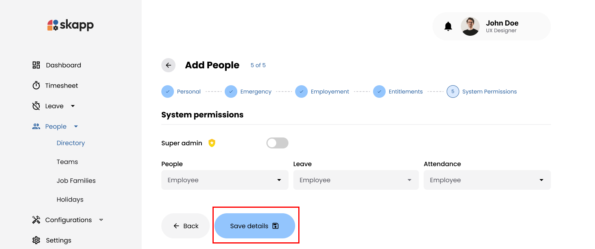

3. The **Share Credentials Modal** appears with:
   - **Account URL**: The login page link.
   - **Username**: The user's work email.
   - **Password**: A temporary password.

---

### Steps 4: Share Credentials

1. Click **Copy Text** to copy the credentials for sharing with the user.

