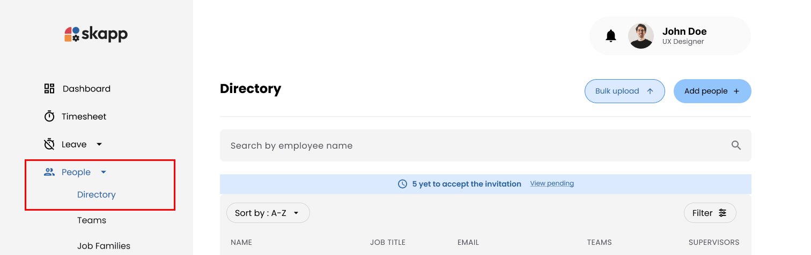
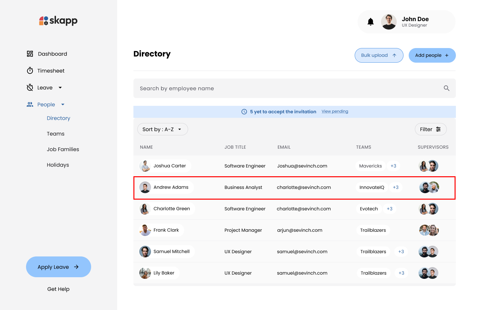
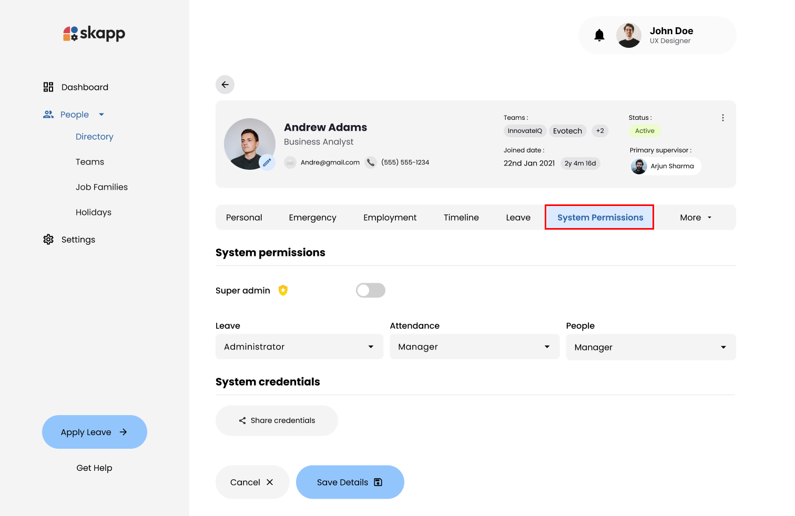
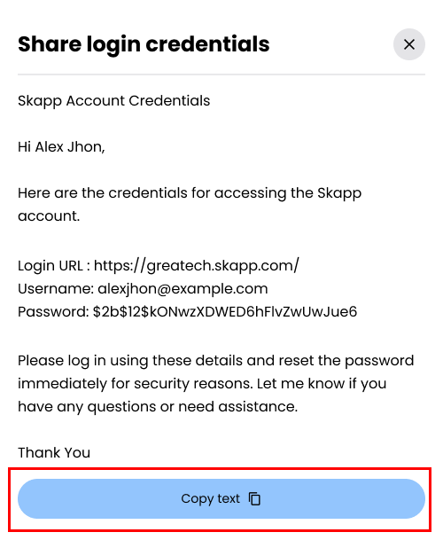
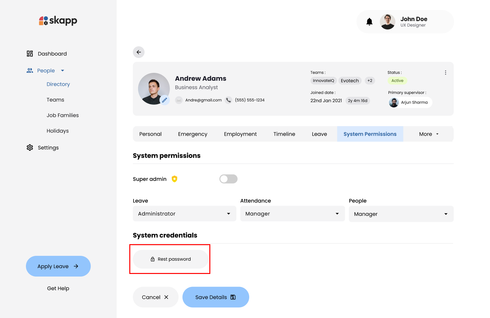

## Introduction

The **Credential Sharing** feature allows administrators to provide login details to new employees who have not accessed the system yet or reset passwords for existing users who may need updated credentials. This guide outlines the step-by-step process for securely managing and sharing credentials, enabling smooth onboarding and quick resolution of access issues.

---

## Accessing the System Permissions Page

### Step 1: Navigate to the Directory

- **Roles Required**: Super Admin or People Admin.
- Navigate to the **Directory** via the **People** section in the navigation bar.

- Select an employee from the directory to view their profile.

### Step 2: Access the System Permissions Tab

- In the employee's profile, locate and click on the **System Permissions** section.
- This will navigate to the **System Permissions Page** for the selected employee, displaying their roles and permissions.

---

## Sharing Credentials for New Employees

### Step 1: Locate the Share Credentials Button

- If the employee has not yet logged into the system and reset their password, the **Share Credentials** button is visible below the system roles on the **System Permissions Page**.

### Step 2: Open the Share Credentials Modal

- Click the **Share Credentials** button to open the modal.

### Step 3: Share the Credentials

- Click **Copy** to copy the message template.

- Share the credentials with the employee (e.g., via email or messaging).
- Close the modal to return to the employee's profile.

---

## Resetting Password for Existing Employees

### Step 1: Locate the Reset Password Button

- If the employee has already logged in and reset their password, the **Reset Password** button replaces the **Share Credentials** button on the **System Permissions Page**.

### Step 2: Reset the Password

- Click the **Reset Password** button.

- The system generates a new temporary password for the employee.
- The employee will be logged out immediately if they are currently logged into the system.

### Step 3: Share Credentials After Reset

- After resetting the password, the **Reset Password** button changes back to **Share Credentials**.
- Click the **Share Credentials** button to open the modal.

### Step 4: Share the New Credentials

- Click **Copy** to copy the updated message template.
- Share the new credentials with the employee.
- Close the modal to return to the employee's profile.
